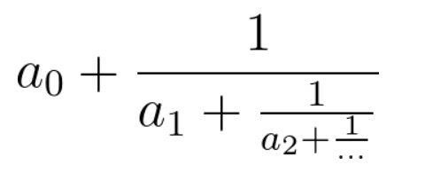

# [LeetCode LCP 2. 分式化简](https://leetcode-cn.com/problems/deep-dark-fraction/)

## 1. 题目描述

有一个同学在学习分式。他需要将一个连分数化成最简分数，你能帮助他吗？



连分数是形如上图的分式。在本题中，所有系数都是大于等于0的整数。

输入的cont代表连分数的系数（cont[0]代表上图的a0，以此类推）。返回一个长度为2的数组[n, m]，使得连分数的值等于n / m，且n, m最大公约数为1。

**示例 1：**

```
输入：cont = [3, 2, 0, 2]
输出：[13, 4]
解释：原连分数等价于3 + (1 / (2 + (1 / (0 + 1 / 2))))。注意[26, 8], [-13, -4]都不是正确答案。
```

**示例 2：**

```
输入：cont = [0, 0, 3]
输出：[3, 1]
解释：如果答案是整数，令分母为1即可。
```

**限制：**

```
1. cont[i] >= 0
2. 1 <= cont的长度 <= 10
3. cont最后一个元素不等于0
4. 答案的n, m的取值都能被32位int整型存下（即不超过2 ^ 31 - 1）。
```

## 2. 思路

up 表示分子，down 表示分母
递推公式： up = up + cont[i] * down，然后交换 up 和 down


**执行结果：**

执行用时 :0 ms, 在所有 Java 提交中击败了100.00%的用户
内存消耗 :34.5 MB, 在所有 Java 提交中击败了49.08%的用户

## 3. 代码

```java
    /**
     * up 表示分子，down 表示分母
     * 递推公式： up = up + cont[i] * down，然后交换 up 和 down
     *
     * @param cont
     * @return
     */
    public int[] fraction(int[] cont) {
        int up = 1;
        int down = cont[cont.length - 1];
        int temp;
        for (int i = cont.length - 2; i >= 0; i--) {
            up += cont[i] * down;
            temp = up;
            up = down;
            down = temp;
        }
        // 多交换了一次
        return new int[]{down, up};
    }
```


## [LeetCode练习笔记](https://github.com/YoungBear/LeetCodeSolution)